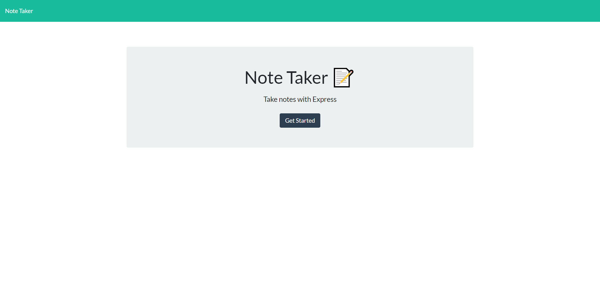
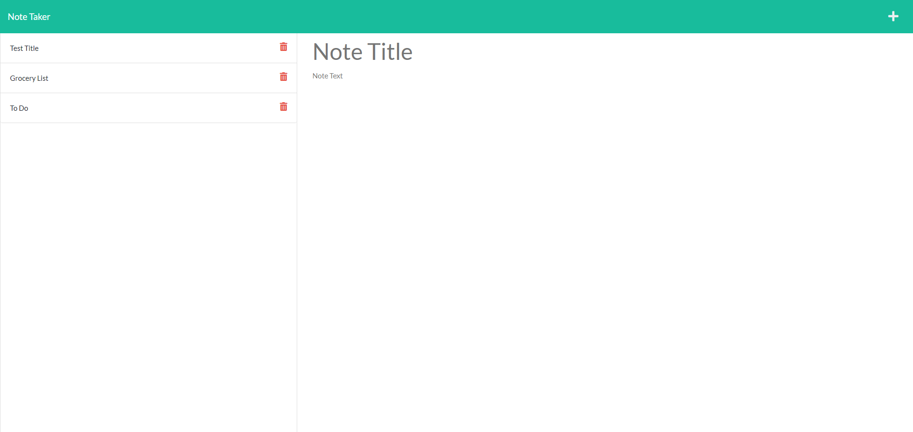

# Express.js Note Taker

## Description
- My motivation for this project was to create a simple note-taking application that allows a user to write, save, and delete notes.
- This was accomplished through using an Express.js backend that saves and retireves note data from a JSON file. 

## Technologies Used
- HTML
- CSS
- JavaScript
- Node.js
- Express.js

## Screenshots

## Link
https://note-taker-mw.herokuapp.com/